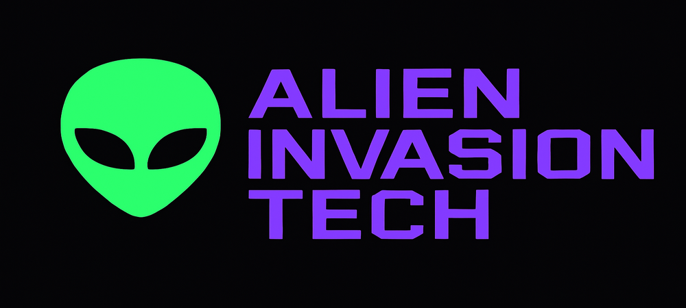
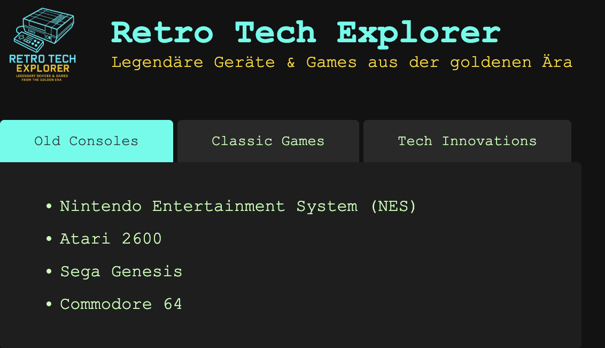

<p align="center">

</p>

# Projekt: **Alien Invasion Technologie Tabs**

Ziel ist es, eine kleine Webseite zu bauen, auf der verschiedene Aspekte einer fiktiven **Alien-Technologie-Invasion** dargestellt werden – sortiert in Tabs ähnlich wie bei einem Informations-Dashboard.

---

## HTML-Vorgabe

```html
<!DOCTYPE html>
<html lang="de">
<head>
  <meta charset="UTF-8" />
  <title>Alien Invasion Tech</title>
  <link rel="stylesheet" href="styles.css" />
  <script src="script.js" defer></script>
</head>
<body>
  <header>
    
    <div>
      <h1>Alien Invasion Tech</h1>
      <p>Geheime Technologien aus fernen Galaxien</p>
    </div>
  </header>

  <div id="tabs">
    <menu>
      <button id="btn-propulsion" class="active">Antrieb & Tarnung</button>
      <button id="btn-biotech">Biotechnologie</button>
      <button id="btn-risks">Gefahrenanalyse</button>
    </menu>
    <div id="tab-content"></div>
  </div>
</body>
</html>
```
<div style="page-break-after: always;"></div>

---

## Projektstruktur & Anleitung

### 1. **Arbeiten mit dem bestehenden HTML-Gerüst**
Die Struktur ist fix und darf nicht verändert werden. Wichtige Hinweise:
- Die angegebenen IDs müssen exakt so bestehen bleiben (z.B. `btn-propulsion`, `tab-content`)
- Reihenfolge und Hierarchie der Elemente sollten unverändert bleiben
- Ergänzungen dürfen nur über JavaScript erfolgen

### 2. **JavaScript-Datei (`script.js`) erstellen**
- Ein Array anlegen, das die vorgegebenen Inhalte enthält (siehe weiter unten)
- Eine Funktion schreiben, die beim Klick auf einen Button den entsprechenden Inhalt anzeigt
- Mit `event.target.id` herausfinden, welcher Button gedrückt wurde
- Vor dem Einfügen neuen Inhalts den alten Inhalt im Bereich `#tab-content` entfernen

### 3. **Tabs aktiv markieren**
- Es soll immer nur ein Button als "aktiv" hervorgehoben sein
- Durch Entfernen und Hinzufügen einer CSS-Klasse "active" wird dies gesteuert

### 4. **Gestaltung mit CSS (`styles.css`)**
- Der Header sollte ein spaciges, futuristisches Design erhalten
- Farben wie Neon-Grün, Lila oder Cyan passen gut zum Thema Alien-Invasion
- Tabs und Inhalte sollen gut sichtbar und optisch voneinander abgegrenzt sein

---

## Inhalte

Diese Inhalte sollen als Array in der JavaScript-Datei hinterlegt werden:

```javascript
const content = [
  [
    "Graviton-Antriebssysteme aus der Andromeda-Galaxie",
    "Antimaterie-Reaktoren mit Subraumstabilisatoren",
    "Tarnfeld-Technologie, die Licht und Radar bricht",
    "Teleportationsportale für Sofort-Invasionen"
  ],
  [
    "Gedankenkontroll-Chips zur Manipulation der Menschheit",
    "Bio-Maschinen mit organischer Software",
    "Nano-Sonden zur Atmosphärenanpassung",
    "Hybridisierung zwischen Alien-DNS und irdischer Biologie"
  ],
  [
    "Gefahr durch planetenweites EMP",
    "Technologie-Reverse-Engineering durch Menschen",
    "Kampfroboter vs. Alien-Drohnen – Vergleich",
    "Alien-Basis auf der Rückseite des Mondes entdeckt"
  ]
];
```
<div style="page-break-after: always;"></div>

---

## So könnte die fertige Webseite aussehen
<p align="center">
    
</p>
---

## Bonus
- Kleine Icons vor den Listeneinträgen einfügen
- Sanfte Animationen beim Wechseln der Tabs
- Schriftarten aus Google Fonts integrieren

