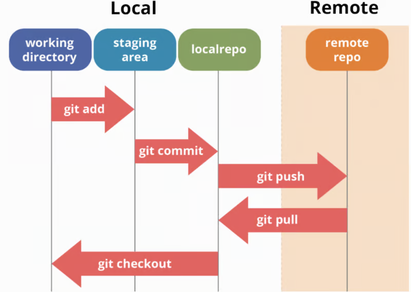

# Git

## Was ist Git

Git ist ein verteiltes Versionskontrollsystem (DVCS), das von [Linus Torvalds entwickelt](https://git-scm.com/book/de/v2/Erste-Schritte-Kurzer-%C3%9Cberblick-%C3%BCber-die-Historie-von-Git) wurde. 

Es ermöglicht Entwicklern, Änderungen am Quellcode zu verfolgen und parallel an Projekten zu arbeiten. Jeder Benutzer hat eine vollständige Kopie des Projektverlaufs auf seinem lokalen Rechner, was unabhängiges Arbeiten und einfache Zusammenarbeit in Teams unterstützt. Git ist heute ein Standardwerkzeug in der Softwareentwicklung.

## Git Workflow

Der Git-Workflow umfasst mehrere wichtige Stadien, die die Bearbeitung und Nachverfolgung von Änderungen an Dateien strukturieren:

&copy; [DEV Community](https://dev.to/mollynem/git-github--workflow-fundamentals-5496)

1. Arbeitsverzeichnis (Working Directory): Hier bearbeiten Entwickler ihre Dateien. Alle Änderungen werden zunächst lokal vorgenommen.

2. Staging-Bereich (Staging Area): Bevor Änderungen festgeschrieben (committed) werden, müssen sie in den Staging-Bereich hinzugefügt werden. Dies ermöglicht es Entwicklern, gezielt bestimmte Änderungen auszuwählen und zu überprüfen, bevor sie sie offiziell ins Repository aufnehmen. Der Staging-Bereich dient also als Zwischenspeicher, um sicherzustellen, dass nur überprüfte und gewollte Änderungen festgeschrieben werden.

3. Repository (Local Repo): Sobald Änderungen committed sind, werden sie dauerhaft im lokalen Repository gespeichert. Jeder Commit stellt einen Snapshot des Projekts zu einem bestimmten Zeitpunkt dar. Dies ermöglicht es, den Projektverlauf zurückzuverfolgen und bei Bedarf zu einer früheren Version zurückzukehren.

4. Remote-Repository: Um Änderungen mit anderen Teammitgliedern zu teilen, werden sie vom lokalen Repository in ein Remote-Repository gepusht, zum Beispiel auf Plattformen wie GitHub. Das Remote-Repository fungiert als zentrale Ablage, auf die alle Teammitglieder zugreifen können. Es ermöglicht die Synchronisation der Arbeit und fördert die Zusammenarbeit im Team.

## Das Git Konzept

### Repository

Ein Repository ist ein lokaler oder remoter Speicherort, der alle Dateien eines Projekts und deren Versionsgeschichte enthält. Es dient als zentrale Datenbank für alle Änderungen, die an einem Projekt vorgenommen werden. Jedes Git-Projekt besitzt mindestens ein Repository.

### Add

Der Befehl git add dient dazu, geänderte oder neu hinzugefügte Dateien für den nächsten Commit vorzubereiten. Durch `git add` werden die Änderungen in den Staging-Bereich übernommen. Dieser Bereich dient als Zwischenablage, bevor die Änderungen dauerhaft gespeichert werden.

### Commit

Ein Commit ist eine Momentaufnahme des Projekts zu einem bestimmten Zeitpunkt. Mit dem Befehl `git commit` werden die im Staging-Bereich befindlichen Änderungen dauerhaft im Repository gespeichert. Jeder Commit erhält einen eindeutigen Bezeichner (Hash), der es ermöglicht, die Änderungen später zu identifizieren und wiederherzustellen. Zudem wird bei jedem Commit eine Nachricht erstellt, die den Zweck der Änderungen beschreibt.

### Branch

Ein Branch in Git ist eine unabhängige Entwicklungslinie innerhalb eines Repositories. Er ermöglicht es, parallel zur Hauptentwicklungslinie (main oder master) an neuen Features, Bugfixes oder Experimenten zu arbeiten, ohne den stabilen Code der Hauptlinie zu beeinflussen.

#### Warum Branches?

- Isolierte Entwicklung: Arbeite an neuen Funktionen, ohne den bestehenden Code zu stören.
- Experimente: Probiere neue Ideen aus, ohne Risiken einzugehen.
- Zusammenarbeit: Verschiedene Entwickler können gleichzeitig an unterschiedlichen Teilen des Projekts arbeiten.

#### Branches Befehle

- `git branch <name>`: Erstellt einen neuen Branch.
- `git checkout <name>`: Wechselt in einen bestehenden Branch.
- `git merge <name>`: Fügt die Änderungen eines Branches in einen anderen zusammen.